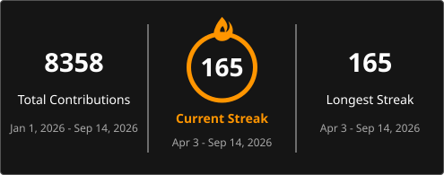

  

  <h3>Building secure systems, investigating digital threats, and shipping tools that make the web harder to break.</h3>
  

    
    
    
  

  
  
  
  
  

 

  

 

<table width="100%">
  <tr>
    <td width="58%" valign="top">
      <h2>Cyber + Builder</h2>
      

        I work at the intersection of cybersecurity, digital investigation, and product engineering.
        My focus is on OSINT, digital forensics, ethical hacking, and building practical tools that turn security ideas into working systems.
      

      

        I am based in Bangalore, India, currently pursuing BCA at GM University, and I have trained startup cohorts on cybersecurity fundamentals and threat awareness.
      

      

        Current direction: stronger secure-by-design engineering, better investigation workflows, and sharper developer tooling for real-world use.
      

    </td>
    <td width="42%" valign="top">
      <h2>Current Focus</h2>
      

        <strong>Mission:</strong> Bridge web development with digital security.
      

      

        <strong>Working on:</strong> security tooling, applied AI projects, and sharper developer experiences.
      

      

        <strong>Open to:</strong> collaboration on security tools, cyber awareness products, and useful open-source builds.
      

      

        <strong>Featured live project:</strong> 
        <a href="https://aniket886.github.io/datawipingtool/#download">Data Wiping Tool</a>
      

    </td>
  </tr>
</table>

 

<h2 align="center">Tech Stack</h2>

  <strong>Security + Investigation</strong> 
  
  
  
  

 

  <strong>Languages</strong> 
  

 

  <strong>Web + App Tooling</strong> 
  

 

  <strong>Platforms + Environment</strong> 
  
   
  
  
  
  

 

  <strong>Design &amp; No-Code</strong> 
  
  
  

  <strong>AI Tools &amp; Agents</strong> 
  
  
  
  
  
  
  

<h2 align="center">Live Metrics</h2>

  

  

 

<h2 align="center">Contribution Snake</h2>

  <picture>
    <source media="(prefers-color-scheme: dark)" srcset="./assets/github-snake-dark.svg" />
    <source media="(prefers-color-scheme: light)" srcset="./assets/github-snake.svg" />
    
  </picture>

 

<h2 align="center">Mission Control</h2>

<table width="100%">
  <tr>
    <td width="50%" valign="top">
      <h3>Command Panel</h3>
      

        
         
        
         
        
         
        
         
        
      

      

        <strong>Signal:</strong> I prefer practical, working systems over theory-only demos. 
        <strong>Intent:</strong> Build tools that help people investigate, understand, and defend.
      

      

        
      

    </td>
    <td width="50%" valign="top">
      <h3>Project Radar</h3>
      
<strong>Recent high-work repos from the last 6 months</strong>

      

        <a href="https://github.com/Aniket886/hand-gestures"><strong>hand-gestures</strong></a> 
        ArcMotion build with the heaviest recent commit activity: spatial interaction, gesture tracking, voice controls, and UI refinements.
         
        
        
      

      

        <a href="https://github.com/Aniket886/terralens"><strong>terralens</strong></a> 
        Recent product work with active iteration in early April.
         
        
      

      

        <a href="https://github.com/Aniket886/tech-carnival-site"><strong>tech-carnival-site</strong></a> 
        Event-site and frontend execution work that stayed active through late March.
         
        
      

      

        <a href="https://github.com/Aniket886/Date-Time-Offset-Application"><strong>Date-Time-Offset-Application</strong></a> 
        Utility-focused build that also saw recent shipping activity inside the same 6-month window.
         
        
      

    </td>
  </tr>
</table>

 

  
<strong>Open to collaborations in cybersecurity, tooling, and useful open-source products.</strong>

  

