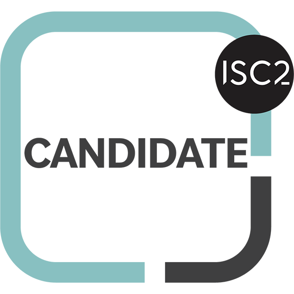
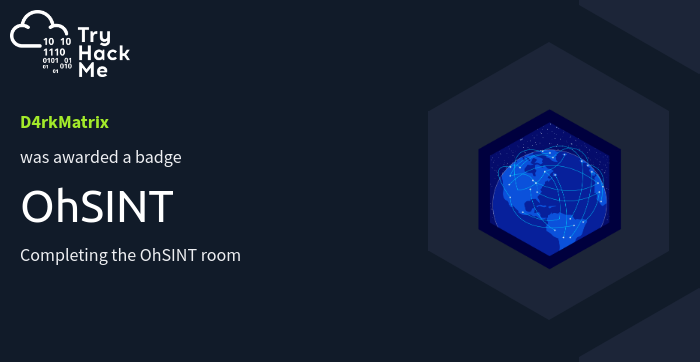
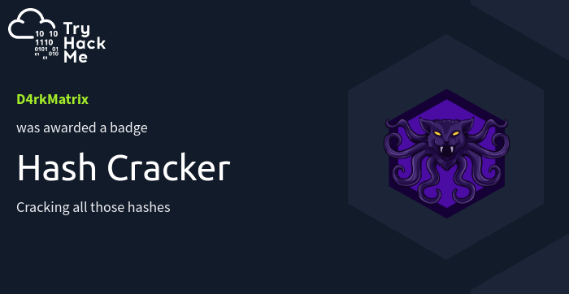
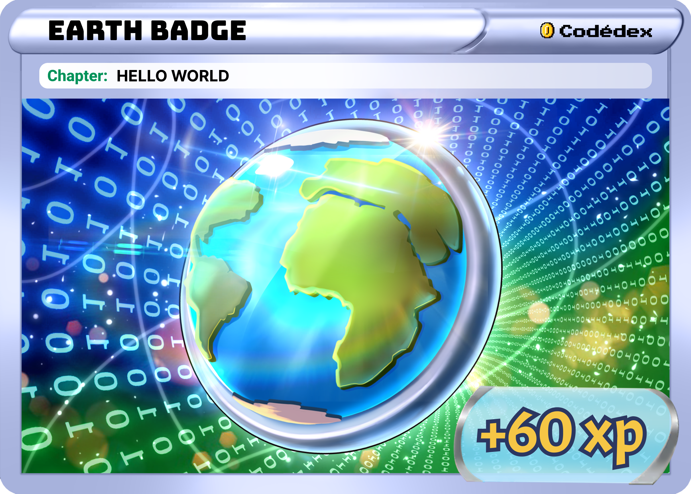
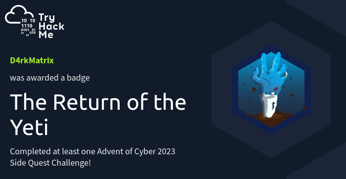
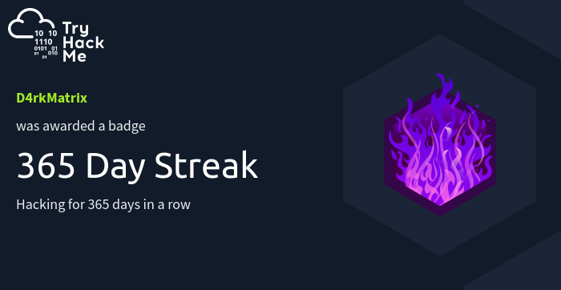
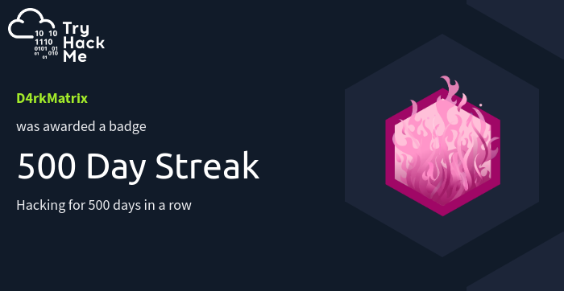
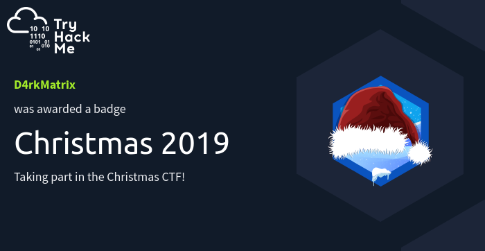

<div align="center">
  <!-- Dynamic Hero Banner -->
  

  <br />

  <!-- Animated Typing Tagline -->
  <a href="https://git.io/typing-svg">
    
  </a>

  <p align="center">
    <strong>Founder of CYBER DRAVIDA • Building resilient systems, investigating digital threats, shipping intelligent web apps, and training future defenders.</strong>
  </p>

  <!-- Live Profile Counters -->
  <p align="center">
    
    
    
  </p>

  <!-- Social & Connection Bar -->
  <p align="center">
    <a href="https://linktr.ee/anikettegginamath" target="_blank">
      
    </a>
    <a href="https://www.linkedin.com/in/aniket-tegginamath-420324251/" target="_blank">
      
    </a>
    <a href="https://tryhackme.com/p/D4rkMatrix" target="_blank">
      
    </a>
    <a href="http://medium.com/@anikettegginamath" target="_blank">
      
    </a>
    <a href="https://www.youtube.com/@anonymous_3301x" target="_blank">
      
    </a>
    <a href="mailto:aniket.gmu@gmail.com">
      
    </a>
    <a href="https://www.buymeacoffee.com/aniket_tegginamath" target="_blank">
      
    </a>
  </p>
</div>

---

### ⚡ Cyber HUD & Executive Overview

```bash
aniket@security-ops:~# cat profile.json
{
  "name": "Aniket Tegginamath",
  "callsign": "D4rkMatrix",
  "linktree": "https://linktr.ee/anikettegginamath",
  "founder": "CYBER DRAVIDA (https://cyberdravida.in)",
  "location": "Bangalore, Karnataka, India 🇮🇳",
  "academics": "BCA (Bachelor of Computer Applications) @ GM University",
  "credentials": ["(ISC)² Candidate", "Google Cybersecurity Certified", "MongoDB AI & Innovation"],
  "disciplines": [
    "Founder & Lead Trainer @ CYBER DRAVIDA",
    "Cybersecurity Student & Ethical Hacker",
    "Full-Stack Web Architect",
    "Applied AI/ML & Computer Vision Developer",
    "Digital Forensics & OSINT Investigator"
  ],
  "mission": "Empowering future defenders through CYBER DRAVIDA, engineering secure-by-design applications, and automating digital investigations.",
  "status": "🟢 Actively Building, Auditing & Mentoring"
}
```

---

### 🏛️ The Five Pillars of Practice

<table width="100%">
  <tr>
    <td width="50%" valign="top">
      <h4>🛡️ 1. Cybersecurity & Defense</h4>
      <ul>
        <li><strong>Core Focus:</strong> Vulnerability assessment, hardening, and network security.</li>
        <li><strong>Credentials:</strong> (ISC)² Candidate & Google Cybersecurity Certified.</li>
        <li><strong>Hands-On:</strong> Active CTF & security lab solver on TryHackMe (<code>D4rkMatrix</code>).</li>
      </ul>
    </td>
    <td width="50%" valign="top">
      <h4>🌐 2. Full-Stack Web Dev</h4>
      <ul>
        <li><strong>Core Stack:</strong> React, Vite, Tailwind CSS, TypeScript, Node.js & REST APIs.</li>
        <li><strong>Engineering:</strong> Secure-by-design architectures, auth flows, and webhooks.</li>
        <li><strong>Performance:</strong> High-speed responsive web applications and clean UI/UX.</li>
      </ul>
    </td>
  </tr>
  <tr>
    <td width="50%" valign="top">
      <h4>🤖 3. AI / ML & Spatial Systems</h4>
      <ul>
        <li><strong>Computer Vision:</strong> Real-time gesture tracking & spatial interaction (<em>ArcMotion</em>).</li>
        <li><strong>Local AI & Agents:</strong> Local LLMs via Ollama, agentic workflows, and code AI tools.</li>
        <li><strong>Resilience:</strong> Scalable AI patterns recognized by MongoDB AI & Innovation.</li>
      </ul>
    </td>
    <td width="50%" valign="top">
      <h4>🔍 4. Forensics & OSINT</h4>
      <ul>
        <li><strong>OSINT Recon:</strong> Asset reconnaissance, digital footprints, and threat intelligence.</li>
        <li><strong>DFIR Tooling:</strong> Anti-forensic data sanitization (<em>Data Wiping Tool</em>) & hash analysis.</li>
        <li><strong>Achievements:</strong> Proven badges in OhSINT, Hash analysis, and forensic rooms.</li>
      </ul>
    </td>
  </tr>
  <tr>
    <td colspan="2" valign="top">
      <h4>🎓 5. Cybersecurity Trainer & Community Educator — Founder, CYBER DRAVIDA</h4>
      <p>
        <a href="https://www.cyberdravida.in" target="_blank">
          
        </a>
        <a href="https://www.cyberdravida.in" target="_blank">
          
        </a>
        
        <a href="https://instagram.com/cyberdravida" target="_blank">
          
        </a>
        <a href="https://www.youtube.com/@CYBERDRAVIDA" target="_blank">
          
        </a>
      </p>
      <ul>
        <li><strong>Founder @ <a href="https://www.cyberdravida.in">CYBER DRAVIDA</a>:</strong> Spearheading defensive security education, OSINT research, and digital threat awareness.</li>
        <li><strong>Community Impact:</strong> Mentored & trained <strong>1,500+ students</strong> and startup cohorts in cyber defense, ethical hacking, and threat mitigation.</li>
        <li><strong>Hands-On Training:</strong> Delivering 1:1 mentorship, live community masterclasses, and technical security breakdowns on YouTube & Medium.</li>
      </ul>
    </td>
  </tr>
</table>

---

### 🛠️ Technical Arsenal & Ecosystem

<div align="center">

  <!-- Security & Investigation -->
  <p><strong>🛡️ Security, Forensics & OSINT</strong></p>
  <p>
    
    
    
    
    
    
    
    
  </p>

  <!-- Languages -->
  <p><strong>💻 Languages & Scripting</strong></p>
  <p>
    <a href="https://skillicons.dev">
      
    </a>
  </p>

  <!-- Web & Backend Engineering -->
  <p><strong>🌐 Web & Backend Engineering</strong></p>
  <p>
    <a href="https://skillicons.dev">
      
    </a>
    <br />
    
    
    
    
    
  </p>

  <!-- AI / ML & Agentic Tools -->
  <p><strong>🤖 AI, ML & Agentic Tooling</strong></p>
  <p>
    
    
    
    
    
    
  </p>

  <!-- Platforms, Cloud & Design -->
  <p><strong>☁️ Platforms, Cloud & Design</strong></p>
  <p>
    <a href="https://skillicons.dev">
      
    </a>
    <br />
    
    
    
  </p>

</div>

---

### 🚀 Featured Systems & Project Radar

<table width="100%">
  <tr>
    <td width="50%" valign="top">
      <h4>🤖 <a href="https://github.com/Aniket886/hand-gestures">ArcMotion — Hand Gestures & Spatial UI</a></h4>
      <p>
        
        
      </p>
      <ul>
        <li>Real-time hand-landmark recognition and spatial gesture tracking engine.</li>
        <li>Voice-activated navigation and low-latency interaction controls.</li>
      </ul>
    </td>
    <td width="50%" valign="top">
      <h4>🛡️ <a href="https://aniket886.github.io/datawipingtool/#download">Secure Data Wiping Tool</a></h4>
      <p>
        
        
      </p>
      <ul>
        <li>Anti-forensics disk sanitization preventing digital forensic reconstruction.</li>
        <li>Cryptographic multi-pass overwrite patterns meeting data shredding standards.</li>
      </ul>
    </td>
  </tr>
  <tr>
    <td width="50%" valign="top">
      <h4>🌐 <a href="https://github.com/Aniket886/tech-carnival-site">Tech Carnival Portal</a></h4>
      <p>
        
        
      </p>
      <ul>
        <li>Interactive hackathon and event portal featuring live agenda timelines.</li>
        <li>High-performance responsive UI optimized with Vite & modern CSS.</li>
      </ul>
    </td>
    <td width="50%" valign="top">
      <h4>🌍 <a href="https://github.com/Aniket886/terralens">Terralens</a></h4>
      <p>
        
        
      </p>
      <ul>
        <li>Geospatial environmental intelligence and map-based analytics platform.</li>
        <li>Intuitive visual dashboard delivering real-time geographical data insights.</li>
      </ul>
    </td>
  </tr>
  <tr>
    <td width="50%" valign="top">
      <h4>🛡️ <a href="https://www.cyberdravida.in">CYBER DRAVIDA Platform</a></h4>
      <p>
        
        
      </p>
      <ul>
        <li>Official cybersecurity education, threat awareness, and OSINT research portal.</li>
        <li>Hub for free community masterclasses, student cohorts, and 1:1 mentorship.</li>
      </ul>
    </td>
    <td width="50%" valign="top">
      <h4>⏱️ <a href="https://github.com/Aniket886/Date-Time-Offset-Application">Date-Time Offset Utility</a></h4>
      <p>
        
        
      </p>
      <ul>
        <li>Precision temporal offset calculations and cross-timezone conversions.</li>
        <li>Engineered for rapid, error-free timestamp transformation workflows.</li>
      </ul>
    </td>
  </tr>
</table>

---

### 🏆 Credentials, Honors & Certifications

<div align="center">
  <p>
    <a href="https://tryhackme.com/p/D4rkMatrix" target="_blank">
      
    </a>
  </p>

  <table border="0">
    <tr align="center">
      <td width="165" valign="bottom">
        
        <br /><strong>Google Cybersecurity</strong>
      </td>
      <td width="165" valign="bottom">
        
        <br /><strong>(ISC)² Candidate</strong>
      </td>
      <td width="165" valign="bottom">
        
        <br /><strong>Intro to Cyber</strong>
      </td>
      <td width="165" valign="bottom">
        
        <br /><strong>MongoDB AI & Innovation</strong>
      </td>
    </tr>
    <tr align="center">
      <td width="165" valign="bottom">
        
        <br /><strong>OhSINT Investigation</strong>
      </td>
      <td width="165" valign="bottom">
        
        <br /><strong>Hash & Forensics</strong>
      </td>
      <td width="165" valign="bottom">
        
        <br /><strong>Earth Global Rank</strong>
      </td>
      <td width="165" valign="bottom">
        
        <br /><strong>Advent of Cyber</strong>
      </td>
    </tr>
    <tr align="center">
      <td width="165" valign="bottom">
        
        <br /><strong>365-Day Streak</strong>
      </td>
      <td width="165" valign="bottom">
        
        <br /><strong>500-Day Streak</strong>
      </td>
      <td width="165" valign="bottom">
        
        <br /><strong>Veteran Milestone</strong>
      </td>
      <td width="165" valign="bottom">
        
        <br /><strong>THM Capability Score</strong>
      </td>
    </tr>
  </table>
</div>

---

### 📊 Live Telemetry & Activity

<div align="center">

  <!-- GitHub Streak -->
  <p>
    
  </p>

  <!-- Contribution Activity Graph -->
  <p>
    
  </p>

  <!-- Contribution Snake Animation -->
  <p>
    <picture>
      <source media="(prefers-color-scheme: dark)" srcset="./assets/github-snake-dark.svg" />
      <source media="(prefers-color-scheme: light)" srcset="./assets/github-snake.svg" />
      
    </picture>
  </p>

</div>

---

### 🤝 Connect & Collaborate

<div align="center">
  <p>
    <em>"Where Curiosity Meets Cybersecurity."</em>
  </p>

  <p>
    I am actively open to collaborations in <strong>Cybersecurity Research</strong>, <strong>Digital Forensics Tooling</strong>, <strong>Full-Stack Product Builds</strong>, and conducting <strong>Cyber Defense Training & Workshops via CYBER DRAVIDA</strong>.
  </p>

  <a href="https://www.cyberdravida.in" target="_blank">
    
  </a>
  <a href="mailto:aniket.gmu@gmail.com">
    
  </a>
  <a href="https://www.buymeacoffee.com/aniket_tegginamath" target="_blank">
    
  </a>

  <br /><br />
  <sub>Founded &amp; Engineered by <strong>Aniket Tegginamath</strong> • CYBER DRAVIDA • 2026</sub>
</div>
